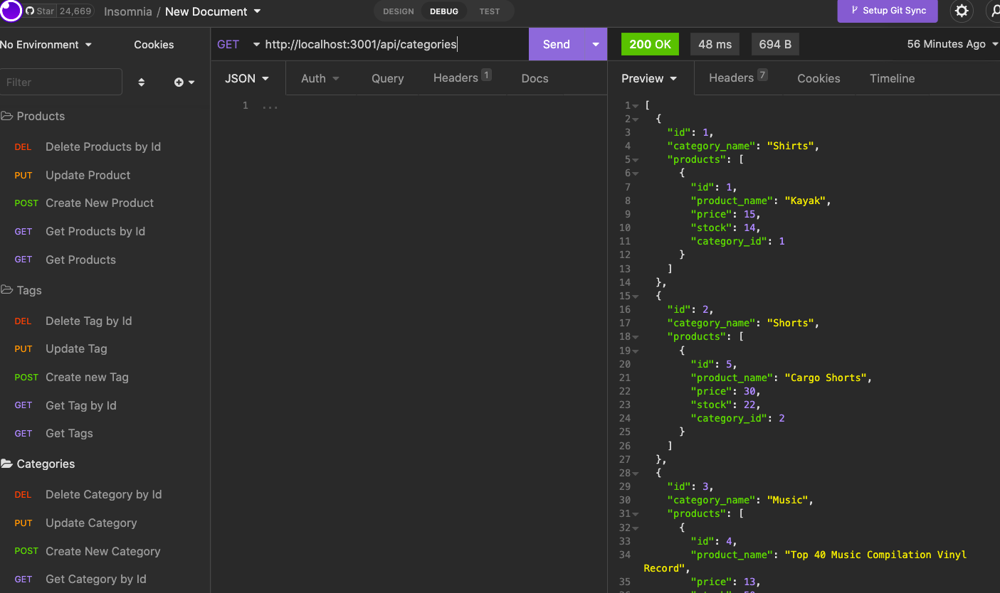

# Shamify-Backend

## Description 

This project is a back-end application for a fictional e-commerce site. This application uses Express.js API configured to Sequelize to interact with a SQL database. This application lacks a front-end and is tested using Insomnia. I was able to learn and impliment all CRUD operations thorugh this project and test them using Isomnia. The biggest challenge with this project was to ensure that the data was being sent through the correct parameters. 

## Installation 

In order to use this application, clone the repository onto your computer, and install node in order to run the application and using Insomnia, use the routes that are connected to the database. 

## Usage 

This application will allow the user to access the seeded data in the seeds folder and through insomnia allow the user to either add, modify or delete data within the database. 

## Credits 

I recieved help from tutor Meg Meyers. 

## License 

MIT License

Copyright (c) [2022] [AlejandraQuintero]

Permission is hereby granted, free of charge, to any person obtaining a copy
of this software and associated documentation files (the "Software"), to deal
in the Software without restriction, including without limitation the rights
to use, copy, modify, merge, publish, distribute, sublicense, and/or sell
copies of the Software, and to permit persons to whom the Software is
furnished to do so, subject to the following conditions:

The above copyright notice and this permission notice shall be included in all
copies or substantial portions of the Software.

THE SOFTWARE IS PROVIDED "AS IS", WITHOUT WARRANTY OF ANY KIND, EXPRESS OR
IMPLIED, INCLUDING BUT NOT LIMITED TO THE WARRANTIES OF MERCHANTABILITY,
FITNESS FOR A PARTICULAR PURPOSE AND NONINFRINGEMENT. IN NO EVENT SHALL THE
AUTHORS OR COPYRIGHT HOLDERS BE LIABLE FOR ANY CLAIM, DAMAGES OR OTHER
LIABILITY, WHETHER IN AN ACTION OF CONTRACT, TORT OR OTHERWISE, ARISING FROM,
OUT OF OR IN CONNECTION WITH THE SOFTWARE OR THE USE OR OTHER DEALINGS IN THE
SOFTWARE.

